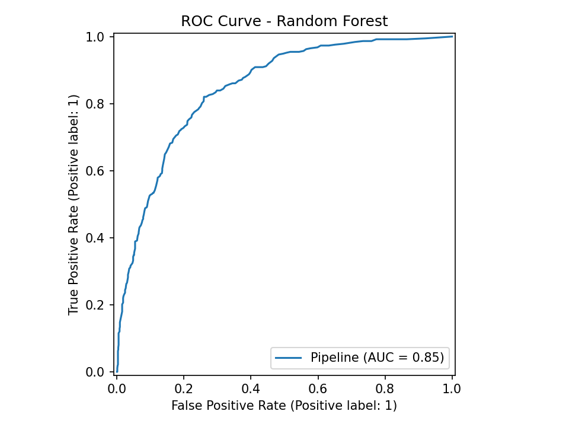

# Installer Retention Forecasting (Churn Prediction)

## 📌 Project Overview
This project uses the public **Telco Customer Churn** dataset (Kaggle) as a proxy for installer retention.
Goal: predict which installers are likely to leave and identify drivers of attrition.

## 🗂 Dataset
Source: https://www.kaggle.com/blastchar/telco-customer-churn  
Download the CSV, rename to `Telco-Customer-Churn.csv`, and keep it **local** in a `data/` folder (don’t commit large data).

## 🛠️ Tools
Python (pandas, numpy, scikit-learn, matplotlib, optional xgboost), Jupyter Notebook

## 📂 Structure
installer-retention-forecasting/
│── data/ (place dataset locally)
│── notebooks/
│   └── retention_forecasting.ipynb  *(you create locally)*
│── results/
│── README.md
│── .gitignore

## 📌 Next Steps
- Run the notebook locally (see notebooks/retention_forecasting.py below)
- Commit results (charts/metrics) and screenshots

